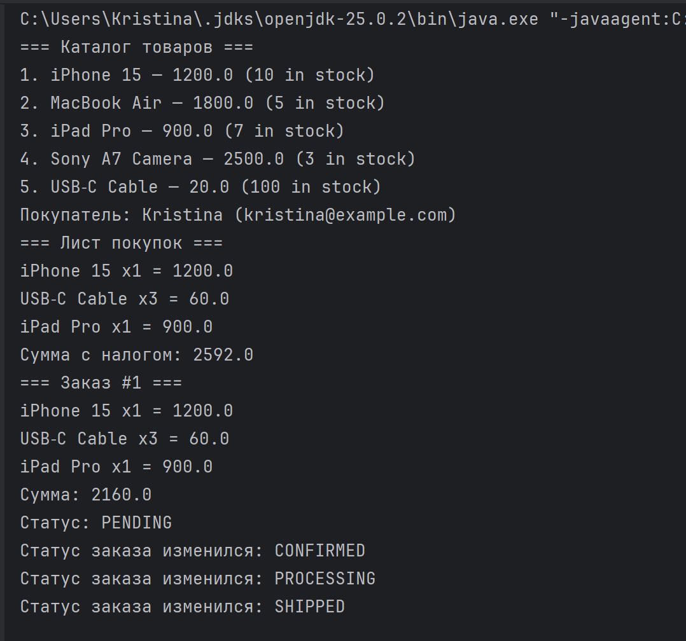
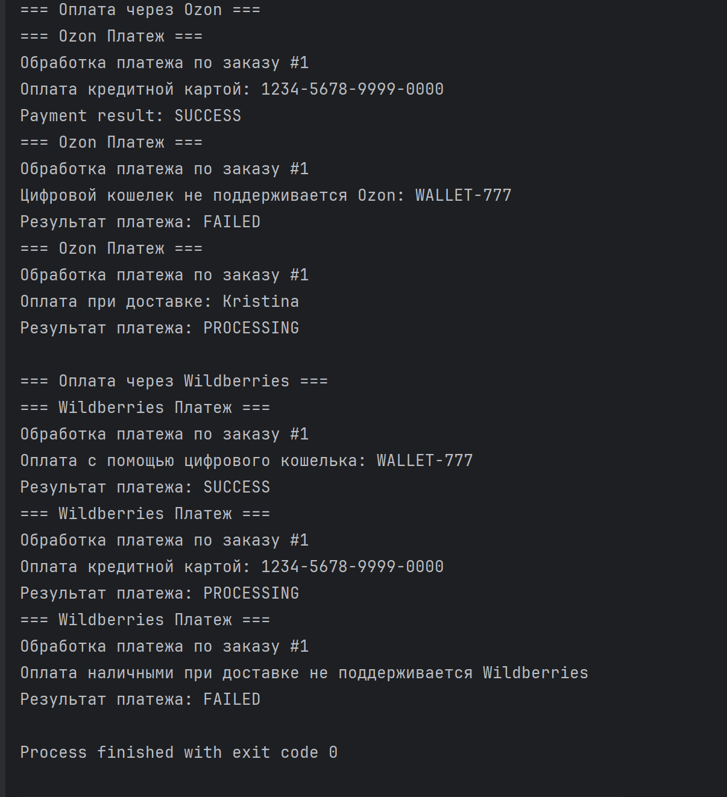
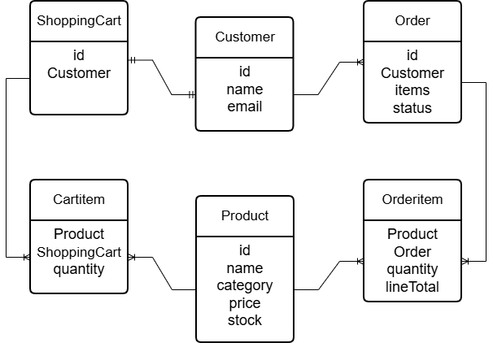

# E-Commerce Console Application (Java)

Учебный проект: консольное приложение, моделирующее базовую логику интернет‑магазина — каталог, корзина, оформление заказа, статусы и платёжная система (Strategy).

---

## О проекте

приложение демонстрирует работу с моделями `Product`, `Customer`, `ShoppingCart`, `Order`, `OrderItem`, `CartItem`, а также платёжную подсистему с двумя провайдерами (`OzonPayment`, `WildberriesPayment`). В проекте используются `record`, `enum`, `sealed interface` и паттерн **Strategy**.

**Технологии**: Java 17+, Maven (или Gradle), стандартная консольная сборка.

---

## Как запустить в IntelliJ

1. **Открытие проекта**
   - File → Open → корневая папка проекта.
2. **Настройка JDK**
   - File → Project Structure → Project → Project SDK → **Java 17**.
3. **Сборка**
   - Если Maven: View → Tool Windows → Maven → Lifecycle → `clean` → `package`.
   - Если Gradle: View → Tool Windows → Gradle → Tasks → build.
4. **Запуск**
   - Открыть `src/main/java/com/moderntech/ecommerce/main/ECommerceApp.java`.
   - Запустить → Run `ECommerceApp.main()`.
5. **Команды в терминале (альтернатива)**
   ```bash
   # Maven
   mvn clean package
   java -jar target/ecommerce-app.jar

   # Gradle (если настроен fatJar)
   ./gradlew build
   java -jar build/libs/ecommerce-app.jar

---

## Скриншот вывода в консоль


---

## ERD 

---
### ФИО: Пачи Кристина Сергеевна
